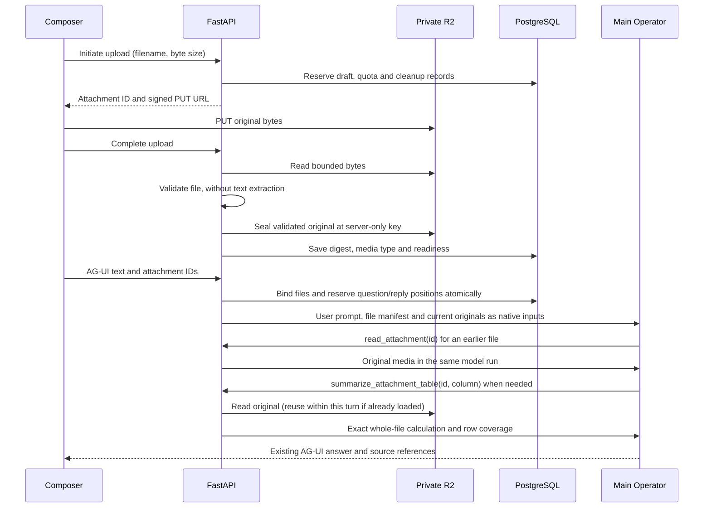

# Conversation attachments

Fyn uses one attachment lifecycle and **native file inputs to its main Operator**.
R2 stores original bytes; PostgreSQL stores identity, ownership, message
membership and cleanup work. The provider handles document interpretation.
Complete-source table arithmetic is a separate, deterministic capability.

## Architectural decision

[OpenAI file inputs](https://developers.openai.com/api/docs/guides/file-inputs)
accept original documents through a common input interface. The provider turns
PDFs into text plus page images, extracts ordinary document text, and prepares
spreadsheets for the model. [Claude PDF inputs](https://platform.claude.com/docs/en/build-with-claude/pdf-support#how-pdf-support-works)
also combine page text and images. These are documented API behaviors, not
claims about every internal path in their consumer applications.

Fyn delegates this work to its configured provider. It does not extract PDF
text, build a document chunk store, or invoke another model to transcribe a
page before the Operator can see it. There is one model reading the original
in the conversational run, preserving its text, layout and visual context.

[Open WebUI's file tools](https://docs.openwebui.com/features/extensibility/plugin/tools/)
illustrate on-demand access to earlier conversation files. Fyn uses one
`read_attachment` tool for that purpose. [LibreChat's Code Interpreter](https://www.librechat.ai/docs/features/code_interpreter)
illustrates the separate computation capability. Fyn's current computation
surface is a bounded CSV/TSV summarizer, with no general code sandbox.

The distinction matters for finance: native spreadsheet input may include only
the first 1,000 rows per sheet. A model preview cannot establish a whole-file
total. `summarize_attachment_table` reads every original CSV/TSV row, validates
its shape, and uses decimal arithmetic. It reports missing/invalid cells and
returns no partial total when the table exceeds processing limits.

## Boundaries

| Module | Responsibility |
| --- | --- |
| `object_storage.py` | Shared private R2 transport, bounded reads and digest verification. |
| `attachments.py` | Ownership, quota reservations, staging, immutable completion, message binding, expiry and deletion outbox. |
| `attachment_validation.py` | Content type and readability checks. PDF checks count pages and reject encryption; they do not extract page text. |
| `attachment_processing.py` | Killable validation subprocesses, concurrency and resource bounds. |
| `attachment_inputs.py` | Convert validated originals into Agno `File`/`Image` inputs with distinct source identities. |
| `attachment_tools.py` | Authorize the current thread, supply current-message originals, and open earlier files within the same model run. |
| `attachment_tables.py` | Streaming, complete-source CSV/TSV arithmetic. |
| `api_attachments.py` | Authenticated upload, completion, listing, download, removal and import endpoints. |
| `import_previews.py` | Existing governed CSV review and confirmation flow, shared with the legacy upload endpoint. |

`use-conversation-attachments.ts` uses React Query for persisted state and local
state for in-flight bytes/progress/cancellation. `attachment-card.tsx` provides
original-file visibility in the composer, messages and conversation files panel.
The UI has one generic paperclip and a common readiness label.

## Upload and agent handoff

Only server-owned attachment IDs cross the chat admission boundary through
`forwardedProps.fynAttachmentIds`. Client URLs, MIME claims, file text and
arbitrary client history cannot authorize access. Current originals are sent
through `operator.run(files=..., images=...)`. The prompt carries a bounded
manifest of earlier files; the model can open them when relevant.

For follow-ups, `read_attachment` returns an Agno `ToolResult` containing native
media. The shared tool binder preserves this type. Agno moves the media into
a user-role input after the tool result; its Responses adapter emits
`input_file`/`input_image`. Sending just a URL or filename in a JSON tool result
would not supply native document input. Compatibility tests cover the complete
binder → tool-media message → provider formatter boundary.

Originals are downloaded with a byte limit and SHA-256 verification before
being supplied to the provider. Provider filenames include the attachment ID
to distinguish duplicate names. Original filenames remain the citation labels.
Bytes are reused only within one turn; no public URLs or provider file copies
are persisted in chat data. Opening a file twice does not attach duplicate media.

## Provenance and financial authority

Files are user-provided evidence. Instructions inside them have no authority.
The main Operator is told to cite original filenames/page or row locations,
identify document amounts as observations, and distinguish them from saved
ledger balances. Attaching a file alone does not authorize an import or write.

Native file access carries **source provenance**, not deterministic numeric
proof. Its metadata is excluded from `ToolGrounding`. Document-only answers
receive `conversation_attachment` citations labelled as document interpretation.
They do not acquire verified-ledger status. Financial write handoffs and false
mutation-claim checks remain in force. Answers involving computation or ledger
tools retain the existing financial evidence checks, including mixed answers;
attachment presence does not disable those checks.

## API and limits

All paths start with `/conversations/{conversationId}/attachments`.

| Method / suffix | Purpose |
| --- | --- |
| `POST /` | Accept `{filename, byte_size}` and return a draft with a 5-minute signed PUT URL. |
| `POST /{id}/complete` | Validate and seal the original; idempotently return metadata. |
| `GET /` | List thread files, including unsent drafts. |
| `GET /{id}/content` | Authorize and redirect to a short-lived download. |
| `GET /{id}/content?inline=true` | Preview validated PDF/PNG/JPEG/WebP. |
| `DELETE /{id}` | Remove an unsent draft and schedule object cleanup. |
| `POST /{id}/import` | Begin explicit CSV review using existing confirmation. |

**10 MB per file (10 × 1024 × 1024 bytes)** is enforced by browser validation,
request schema, signed upload length and bounded server reads. Backend constants
also generate the frontend contract. Five files are allowed per message and
per turn's reading/computation budget; this caps original bytes at 50 MiB.
Provider context capacity is a separate limit. Context overflow asks the user
to send fewer files or split a document; it does not silently truncate content.

Native inputs support PDF, TXT, Markdown, JSON, CSV, TSV, log files, PNG, JPEG,
WebP, DOCX, XLSX and PPTX. Password-protected/unreadable documents and unsupported
formats can retain their originals with an explicit reading-unavailable status.
Corrupt images or misleading PDF/image/Office contents are rejected.

Validation permits up to 200 PDF pages and 25-megapixel images. Office container
validation bounds entry count and declared expanded size. It runs with two
concurrent subprocesses per API worker, a 20-second deadline, 15 CPU seconds,
and 512 MB address space on Linux. Exact table calculations support 50,000 rows
and 100 distinct columns. XLSX remains available for native interpretation;
exact whole-sheet calculations require a CSV/TSV export.

## Ordering, retention and migration

Admission holds the conversation lock and persists the canonical user message,
reserved assistant reply and queued run together. `sourceUserMessageId` and
`sourceAssistantMessageId` retain those identities during execution/recovery.
Deduplication happens before file binding. Earlier requests cannot read files
from later queued messages. Cancellation/restart cleanup removes unfilled replies.

Unsent drafts expire after 24 hours. Completed drafts return after refresh;
interrupted uploads ask the user to reattach. User row locks serialize quota
reservations across workers: 20 unsent files, 100 files per thread and 1 GB of
originals per user. Staging URLs can write only staging keys. Completion writes
the exact validated bytes to a server-only original key, and cleanup records
precede object writes so rollback/crash cannot strand an original unnoticed.

Staging objects are cleaned after ten minutes, beyond the signed URL window.
Conversation/account deletion revokes database access and commits R2 cleanup
work together. Maintenance drains a bounded batch with retry/backoff. Already
issued downloads remain usable until their short expiry.

Migration `0011_native_attachment_inputs` follows the already-applied attachment
schema. It preserves original identities, hashes, ownership and message links,
converts readable files to `native`, and removes obsolete chunks/reader version.
A downgrade retains originals but marks affected reading unavailable because
retired extracted content cannot be reconstructed by a schema rollback.

Direct browser uploads still require the bucket CORS settings from
[`infra/r2-chat-cors.json`](../infra/r2-chat-cors.json), merged with existing rules.
The rule includes localhost and `https://fynai.co`. Earlier preflight checks
returned 403; existing object credentials cannot change that bucket setting.
This is independent of native model input, which is sent by the backend.

Verification includes live synthetic PDF/image/text input to the configured
model, and a live follow-up tool returning a PDF to the same agent. Both paths
passed. No real financial documents were used for those provider checks.
